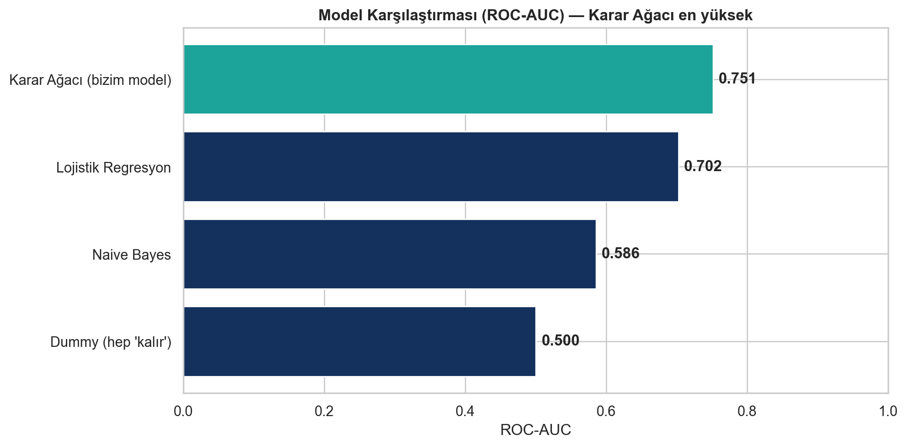
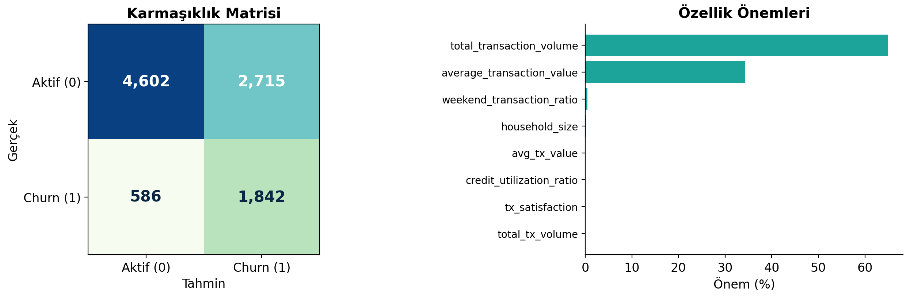
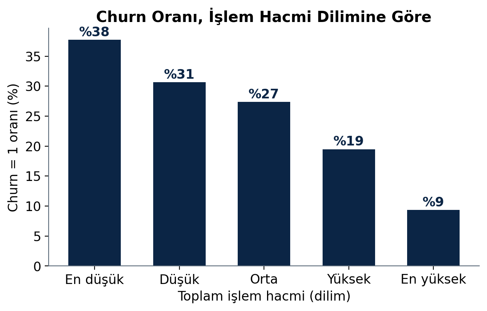
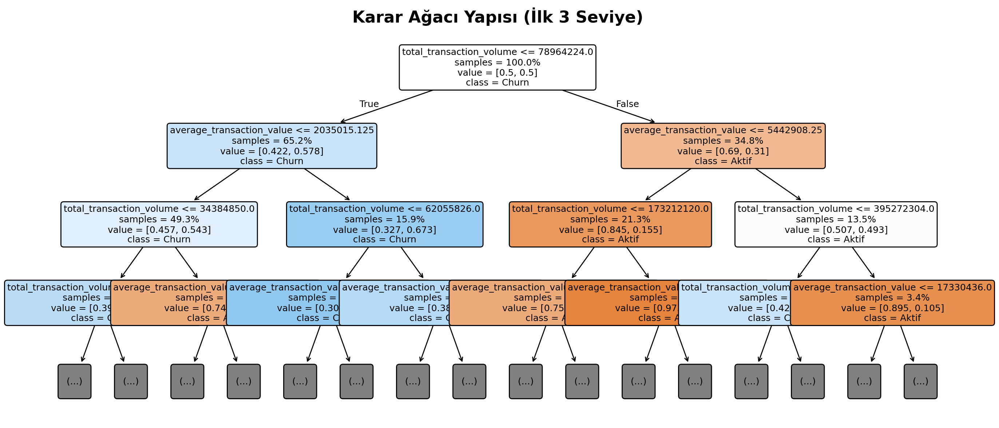

# Fintech Müşteri Kaybı (Churn) Tahmini — Karar Ağacı

> BLM463 Veri Madenciliğine Giriş — Dönem Projesi
> Bir fintech şirketinin müşteri ve işlem verileri üzerinde, **Karar Ağacı (Decision Tree)** ile müşteri kaybını (churn) tahmin eden, veri sızıntısından arındırılmış ve açıklanabilir bir sınıflandırma çalışması.

**Öğrenci:** Ahmet Yılmaz · 22360859044

---

## Özet

Bu projede, Kolombiyalı bir fintech şirketinin gerçek müşteri tabanını içeren **COFINFAD** veri seti kullanılarak müşteri kaybı tahmin edilmiştir. Çalışmanın odağı yalnızca yüksek skor elde etmek değil; **veri sızıntısını (data leakage) önlemek**, sonuçları **doğru metriklerle yorumlamak** ve modeli **açıklanabilir** tutmaktır.

- **Algoritma:** Decision Tree (scikit-learn), `Pipeline` + `ColumnTransformer`, `GridSearchCV` (5-katlı çapraz doğrulama)
- **Hedef:** Churn etiketi, müşterinin işlem aktivitesinden (recency) türetilmiş davranışsal bir **proxy**'dir.
- **Sızıntı önlemi:** Ön işleme train/test ayrımından sonra; hedefle ilişkili/türetilmiş kolonlar dışlandı.

---

## Sonuçlar (Görülmemiş %20 Test Seti)

| Metrik | Değer |
| :--- | :---: |
| Duyarlılık (Recall) | **%75.9** |
| ROC-AUC | **0.751** |
| Dengeli Doğruluk (Balanced Acc.) | %69.4 |
| Doğruluk (Accuracy) | %66.1 |
| Özgüllük (Specificity) | %62.9 |
| Hassasiyet (Precision) | %40.4 |
| F1-Skor | %52.7 |

> **Not — %66 doğruluk neden bir zayıflık değil?** Veri dengesizdir (%25 churn). "Herkes kalır" diyen naif bir taban %75 doğruluk alır ama **hiçbir** kayıp müşteriyi yakalayamaz. Model ise kayıpların dörtte üçünü (Recall %75.9) yakalar. Dengesiz veride ham doğruluk yanıltıcıdır; asıl ölçütler **Recall, ROC-AUC ve Dengeli Doğruluk**'tur — üçü de modelin gerçekten öğrendiğini kanıtlar.

### Baseline (Taban) Model Karşılaştırması
Karar Ağacı, aynı ön işlemeyle eğitilen tüm taban modelleri ROC-AUC'de geçmiştir:



### Model Değerlendirmesi


### Temel İçgörü — İşlem Hacmi ile Churn
İşlem hacmi düştükçe churn oranı belirgin biçimde artmaktadır (en düşük dilimde %38 → en yüksekte %9):



### Karar Ağacı Yapısı (Açıklanabilirlik)


---

## Veri Seti

**COFINFAD — Colombian Fintech Financial Analytics Dataset**
48.723 müşteri, 3.16M işlem, 57 değişken (2023).

> ⚠️ Veri dosyaları (`customer_data.csv`, `transactions_data.csv`) boyutları nedeniyle bu repoda **bulunmamaktadır.** Aşağıdaki kaynaktan indirip proje kökünde `veri/` klasörüne koyunuz:
>
> **Mendeley Data:** https://data.mendeley.com/datasets/mhb4zn3258/1 (DOI: 10.17632/mhb4zn3258.1)

---

## Kurulum ve Çalıştırma

```bash
# 1) Bağımlılıklar
pip install -r requirements.txt

# 2) Veriyi indirip proje köküne yerleştir
#    veri/customer_data.csv
#    veri/transactions_data.csv

# 3) Notebook'u çalıştır
jupyter notebook main.ipynb
```

---

## Dosya Yapısı

```
.
├── main.ipynb                                  # Tüm analiz (EDA, model, değerlendirme)
├── rapor_taslagi.md                            # Detaylı proje raporu (markdown)
├── BLM463_Proje_AhmetYilmaz_22360859044.pdf    # Rapor (PDF)
├── BLM463_Sunum_Churn_KararAgaci.pptx          # Sunum
├── gorseller/                                  # Üretilen grafikler
├── requirements.txt
└── veri/                                       # (repoda yok — yukarıdaki linkten indirilir)
```

---

## Yöntem Özeti

1. **Özellik mühendisliği:** İşlem loglarından frekans, hacim ve zaman tabanlı davranışsal özellikler.
2. **Hedef tanımı:** Churn = en uzun süredir işlem yapmayan %25 (recency proxy).
3. **Veri sızıntısı önlemi:** Önce böl–sonra işle; `churn_probability`, CLV, `customer_segment` gibi sızıntı riski taşıyan kolonların dışlanması.
4. **Modelleme:** `Pipeline` + `ColumnTransformer` (impute / ordinal / one-hot) + Decision Tree, `class_weight='balanced'`, `GridSearchCV` (5-fold).
5. **Değerlendirme:** Karmaşıklık matrisi, ROC, özellik önemleri, baseline karşılaştırması, akademik literatür ile kıyas.

---

## Kaynaklar

- **Veri seti:** Muñoz-Guerrero, L.E., Ceballos, Y.F. & Trejos-Rojas, L.D. (2026). *COFINFAD: A comprehensive dataset of customer behavior in Latin American Fintech.* Data in Brief, 65, 112484.
- **Literatür (karşılaştırma):** Tran, H.D., Le, N. & Nguyen, V.-H. (2023). *Customer churn prediction in the banking sector using machine learning-based classification models.* Interdiscip. J. Inf. Knowl. Manag., 18, 87–105.

---

---
Videoyu izlemek için [buraya tıklayın](https://www.youtube.com/watch?v=aV6FotrzCP4).
---

*BLM463 Veri Madenciliğine Giriş — Dönem Projesi*
