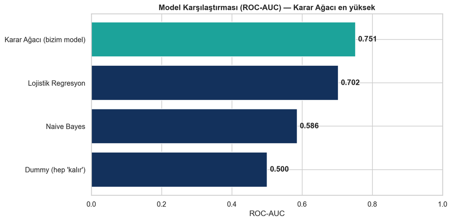
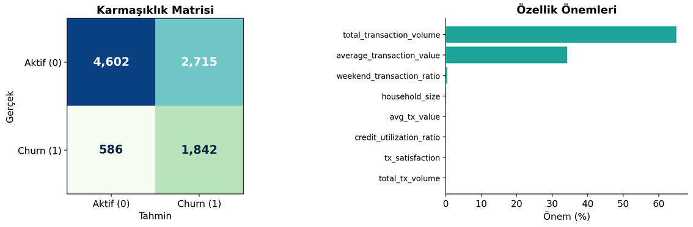
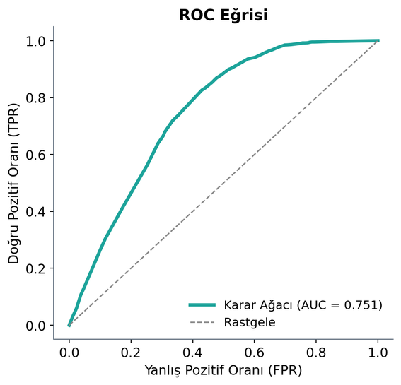
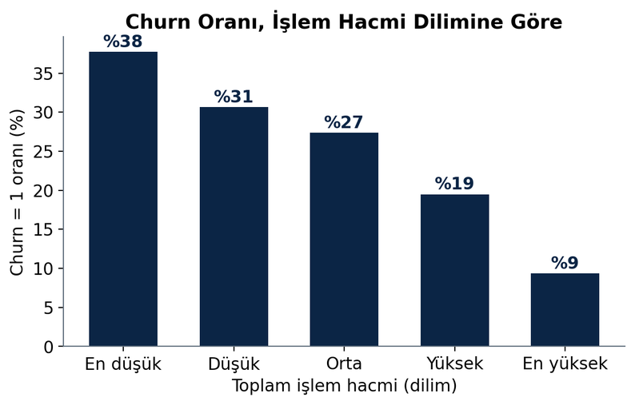
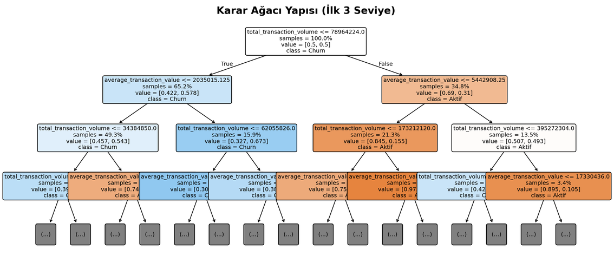

# BLM463 Veri Madenciliğine Giriş Dönem Projesi Raporu
## Karar Ağacı (Decision Tree) ile Müşteri Kayıp (Churn) Analizi ve Tahmini

Öğrenci Bilgileri:
- Ad Soyad: Ahmet Yılmaz
- Öğrenci No: 22360859044
- Ders Kodu: BLM463
- Ödev Konusu: Karar Ağaçları ile Churn Tahmini

Proje Bağlantıları:
- Kaynak Kod (GitHub): https://github.com/ahmetyilmaz-ai/fintech-churn-decision-tree
- Sunum Videosu (YouTube): https://www.youtube.com/watch?v=aV6FotrzCP4

---

### 1. Giriş ve Proje Özeti
Bu çalışmada, bir fintech şirketinin müşteri kayıp (churn) riskini tahmin etmek amacıyla Karar Ağacı (Decision Tree) sınıflandırma algoritması kullanılmıştır. Projenin amacı, CRISP-DM metodolojisine uygun olarak; müşterilerin gerçek işlem davranışından churn'ü tahmin eden, veri sızıntısından arındırılmış ve açıklanabilir bir model geliştirmektir.

Çalışmada kullanılan veri seti COFINFAD (Colombian Fintech Financial Analytics Dataset), Kolombiyalı bir fintech şirketinin 2023 yılı tüm aktif müşteri tabanını kapsayan, anonimleştirilmiş gerçek bir veri setidir. Veri seti iki dosyadan oluşur:
1. `customer_data.csv`: Müşteri başına demografik, hesap, memnuniyet ve davranışsal özellikler (48.723 satır, 54 kolon).
2. `transactions_data.csv`: 12 aylık dönemdeki işlem kayıtları (3.159.157 satır), `customer_id` ile ana tabloya bağlanır.

Kaynak: Muñoz-Guerrero, L.E., Ceballos, Y.F. & Trejos-Rojas, L.D. (2026). COFINFAD: A comprehensive dataset of customer behavior in Latin American Fintech. *Data in Brief*, 65, 112484.

---

### 2. Özellik Mühendisliği (Feature Engineering)
Müşteri seviyesindeki demografik verilere, işlem geçmişinden (transactions) üretilen davranışsal özellikler eklenmiştir.

#### İşlem Loglarından Üretilen Özellikler:
*   İşlem Frekansı ve Hacmi: Toplam işlem sayısı, toplam işlem tutarı, tutarların ortalaması, medyanı, standart sapması, minimum ve maksimum değerleri.
*   Zaman Tabanlı Özellikler (Temporal Features): Müşterinin aktif olduğu gün sayısı, son işleminden bu yana geçen gün sayısı (recency) ve günlük ortalama işlem sıklığı.
*   İşlem Tipi Dağılımı: İşlem türlerine (Mevduat, Çekme, Transfer vb.) göre işlem sayıları ve bunların toplam içindeki oranları.

Amaç, churn tahminini demografik bilgiye ek olarak müşterinin gerçek finansal davranışına (ne sıklıkla, ne kadar, ne zaman işlem yaptığına) dayandırmaktır.

---

### 3. Hedef Değişken (Churn Etiketi) Tanımı
Churn etiketi, müşterinin gerçek işlem aktivitesinden türetilmiştir. Her müşteri için recency (son işleminden bu yana geçen gün sayısı) hesaplanmış ve recency değeri en uzun %25'lik dilimde olan müşteriler kaybedilmiş (churn) kabul edilmiştir:

*   recency > Q75(recency)  →  Churn = 1 (Kayıp müşteri)
*   Aksi halde  →  Churn = 0 (Aktif müşteri)

Bu, sektörde yaygın kullanılan davranışsal churn tanımıdır: uzun süredir işlem yapmayan müşteriler kayıp olarak değerlendirilir. Bu tanım sonucunda churn oranı %24.9 olarak gerçekleşmiştir (dengesiz sınıf).

Önemli — Bu bir vekil (proxy) etikettir: Veri setinde "müşteri gerçekten ayrıldı" bilgisi bulunmadığından, gözlemlenebilir bir davranışı (uzun süredir işlem yapmama) gerçek churn'ün yerine geçen ölçü (proxy) olarak kullanıyoruz. Bu yaklaşım churn literatüründe yaygın ve kabul görmektedir; ancak kusursuz değildir (uzun süre işlem yapmamış bir müşterinin hesabı hâlâ açık olabilir). Bu sınırlamanın bilinçli olarak farkındayız ve sonuçları bu çerçevede yorumluyoruz.

Veri setinde yer alan hazır `churn_probability` kolonu kullanılmamıştır; bu kolon zaten türetilmiş bir tahmin değeridir ve hedef olarak kullanılması veri sızıntısına yol açar.

---

### 4. Veri Sızıntısının (Data Leakage) Önlenmesi
Modelin gerçek performansını ölçebilmek için, eğitim sırasında geleceğe veya hedefe dair hiçbir bilginin sızmaması sağlanmıştır.

1.  Önce Böl, Sonra İşle: Veri seti önce %80 Eğitim, %20 Test olarak bölünmüş; eksik değer doldurma (imputation) ve kategorik kodlama bu ayrımdan sonra yapılmıştır. Eksik değer medyanları yalnızca eğitim setinden (`X_train`) öğrenilip her iki kümeye ayrı uygulanmıştır.
2.  Türetilmiş Kolonların Dışlanması: `churn_probability`, `customer_lifetime_value` (CLV), `clv_segment` gibi hedefle ilişkili veya sonradan hesaplanan kolonlar özellik setinden (`X`) çıkarılmıştır.
3.  Hedef Sızıntısının Engellenmesi: Churn etiketi recency'den tanımlandığı için, recency'yi doğrudan veren kolonlar (`last_tx`, `customer_tenure`, `transaction_frequency`, `avg_daily_transactions`, `monthly_transaction_count` vb.) özellik setinden çıkarılmıştır.
4.  Gizli Sızıntı Önlemi: Müşterinin davranışına göre atanmış olan `customer_segment` (inactive/occasional/regular/power) ve `feedback_sentiment` gibi kolonlar, hedef etiketle (recency tabanlı churn) dolaylı bilgi paylaşma riski taşıdığından özellik setinden çıkarılmıştır. (Kontrol: bu kolonlar modelde zaten ~0 önem aldığından, çıkarılmaları model başarısını değiştirmemiştir.)

---

### 5. Modelleme: Pipeline, Karar Ağacı ve Hiperparametre Tünelleme
Tüm ön işleme adımları (sayısal kolonlarda medyan ile doldurma, sıralı kolonlarda `OrdinalEncoder`, nominal kolonlarda `OneHotEncoder`) `scikit-learn` `Pipeline` ve `ColumnTransformer` yapısıyla model ile tek bir nesnede birleştirilmiştir. Bu sayede dönüşümler çapraz doğrulama sırasında yalnızca eğitim katmanına fit edilir ve veri sızıntısı yapısal olarak engellenir; ayrıca kod endüstriyel standartlara uygun ve tekrar üretilebilir hâle gelir.

Aşırı öğrenmeyi (overfitting) engellemek amacıyla bu Pipeline üzerinde GridSearchCV ile 5-Katlı Çapraz Doğrulama (5-Fold Cross Validation) uygulanmıştır. Sınıf dengesizliğini telafi etmek için `class_weight='balanced'` kullanılmıştır.

#### Optimize Edilen Parametre Uzayı:
*   `max_depth`: `[4, 5, 6, 8]`
*   `min_samples_leaf`: `[20, 50, 100]`
*   `criterion`: `['gini', 'entropy']`

#### Seçilen En İyi Model (GridSearchCV, F1 skoruna göre):
*   `criterion`: `'gini'`
*   `max_depth`: `6`
*   `min_samples_leaf`: `100`

Sığ ağaç derinliği ve yaprak başına minimum örnek kısıtı, hem aşırı öğrenmeye karşı koruma sağlar hem de modelin açıklanabilirliğini artırır.

---

### 6. Model Performansı ve Metrik Değerlendirmeleri
Eğitilen en iyi model, hiç görülmemiş test seti (%20) üzerinde değerlendirilmiştir:

| Metrik | Bu Çalışma | Açıklama |
| :--- | :---: | :--- |
| **Duyarlılık (Recall)** | %75.9 | Gerçek kayıp müşterilerin yakalanma oranı (churn için en kritik metrik) |
| **ROC-AUC** | 0.751 | Modelin sınıfları ayırt etme gücü (öğrenmenin asıl kanıtı) |
| **Dengeli Doğruluk (Balanced Acc.)** | %69.4 | Sınıf dengesizliğine göre düzeltilmiş doğruluk |
| **Doğruluk (Accuracy)** | %66.1 | Genel doğru sınıflandırma oranı |
| **Özgüllük (Specificity)** | %62.9 | Aktif (churn olmayan) müşterileri doğru ayırma oranı |
| **Hassasiyet (Precision)** | %40.4 | Churn tahmin edilenlerin gerçekten churn olma oranı |
| **F1-Skor** | %52.7 | Precision ve Recall'ın harmonik ortalaması |

Karmaşıklık Matrisi (Test seti): Gerçek churn müşterilerinin 1842'si doğru, 586'sı yanlış sınıflandırılmıştır (Recall %75.9). Aktif müşterilerin 4602'si doğru sınıflandırılmıştır.

#### Metriklerin Yorumu:
*   Model gerçekten öğrenmiş midir? Evet. Bunun asıl kanıtı, eşikten bağımsız olan ROC-AUC = 0.751 değeridir (rastgele tahmin 0.5'tir) ve sınıf dengesizliğine göre düzeltilmiş Dengeli Doğruluk = %69.4'tür. Her iki metrik de modelin anlamlı bir ayırt etme gücüne sahip olduğunu gösterir.
*   Churn problemlerinde en kritik metrik Duyarlılık (Recall)'tır; çünkü amaç kaybedilecek müşterileri önceden yakalamaktır. Model bunların %75.9'unu (2428 müşteriden 1842'sini) doğru işaretlemiştir.
*   Doğruluğun (%66.1) görece düşük görünmesi bir zayıflık değildir. Bu veride dengesizlik nedeniyle "tüm müşteriler kalır" diyen naif bir taban %75.1 doğruluk alır; ancak bu taban tek bir kayıp müşteriyi bile (0/2428) yakalayamaz, yani işe yaramaz. Modelimiz doğruluktan bir miktar feragat ederek kayıpların dörtte üçünü yakalar. Dolayısıyla dengesiz veride ham doğruluk yanıltıcıdır; asıl başarı Recall, ROC-AUC ve Dengeli Doğruluk ile ölçülmelidir.

#### Baseline (Taban) Model Karşılaştırması
Karar Ağacı'nın başarısının anlamlı olup olmadığını değerlendirmek için, aynı Pipeline ön işlemesiyle basit taban modeller eğitilip karşılaştırılmıştır:

| Model | Accuracy | Dengeli Doğruluk | Recall | F1 | ROC-AUC |
| :--- | :---: | :---: | :---: | :---: | :---: |
| Dummy ("hep kalır") | %75.1 | %50.0 | %0.0 | %0.0 | 0.500 |
| Lojistik Regresyon | %58.9 | %65.4 | %78.5 | %48.7 | 0.702 |
| Naive Bayes | %35.2 | %56.3 | %98.2 | %43.0 | 0.586 |
| **Karar Ağacı (bu çalışma)** | **%66.1** | **%69.4** | **%75.9** | **%52.7** | **0.751** |

Karar Ağacı, hem ROC-AUC (0.751) hem F1 (%52.7) hem de Dengeli Doğruluk (%69.4) açısından tüm taban modelleri geçmektedir. Bu karşılaştırma, "Neden Karar Ağacı?" sorusuna nesnel bir gerekçe sunar: model, basit alternatiflerden ve naif tabandan anlamlı biçimde daha iyidir.

<i>Şekil 1: Modellerin ROC-AUC karşılaştırması — Karar Ağacı tüm taban modelleri geçmektedir.</i>

---

### 7. Görsel Analizler ve Özellik Önemleri
Proje kapsamında oluşturulan görseller (karmaşıklık matrisi, ROC eğrisi, özellik önem dereceleri ve karar ağacı yapısı) incelendiğinde şu sonuçlara ulaşılmıştır:

*   Özellik Önemleri: Modelin churn kararını domine eden özellikler `total_transaction_volume` (~%65) ve `average_transaction_value` (~%34) olmuştur. Karar ağacının kök düğümü de doğrudan `total_transaction_volume`'dur.
*   İşlem Hacmi – Churn İlişkisi: İşlem hacmi dilimlere ayrıldığında, en düşük hacimli dilimde churn oranı %38 iken en yüksek hacimli dilimde %9'a düşmektedir. Bu monoton ilişki, churn'ün gerçek müşteri davranışıyla açıklanabildiğini ve modelin öğrenebileceği anlamlı bir örüntü olduğunu gösterir.

<i>Şekil 2: Karmaşıklık matrisi (sol) ve özellik önem dereceleri (sağ).</i>

<i>Şekil 3: ROC eğrisi (AUC = 0.751).</i>

<i>Şekil 4: İşlem hacmi dilimine göre churn oranı.</i>

<i>Şekil 5: Karar ağacının ilk seviyeleri (kök düğüm: total_transaction_volume).</i>

---

### 8. Akademik Literatür ile Karşılaştırma
Modelin sonuçları, bankacılık/fintech churn tahmini literatürüyle karşılaştırılmıştır.

| Metrik | Bu Çalışma | Literatür Ort. | Yorum |
| :--- | :---: | :---: | :--- |
| **Duyarlılık (Recall)** | %75.9 | %60 – %75 | Kayıp müşterileri yakalama oranı literatürün üstünde |
| **ROC-AUC** | 0.751 | 0.78 – 0.85 | Ayırt etme gücü literatür aralığına yakın, inandırıcı |
| **F1-Skor** | %52.7 | %70 – %78 | Dengesiz veride recall önceliğinin doğal sonucu |
| **Doğruluk** | %66.1 | %80 – %85 | Tek başına yanıltıcı; dengesiz sınıfta recall daha kritik |

Modelin Recall ve ROC-AUC değerlerinin literatür aralığında olması, savunulabilir ve gerçekçi bir performansa işaret eder. Doğruluğun literatür ortalamasının altında kalması, dengesiz hedefte kayıpları öncelemenin bilinen bir bedelidir.

Literatür kaynağı (örn.): Tran, H.D., Le, N. & Nguyen, V.-H. (2023). Customer churn prediction in the banking sector using machine learning-based classification models. *Interdiscip. J. Inf. Knowl. Manag.*, 18, 87–105.

---

### 9. Sonuç ve İş Önerileri
Geliştirilen açıklanabilir karar ağacı modeli, müşterinin işlem davranışından churn riskini gerçekçi bir başarıyla tahmin etmektedir. Modelin yüksek açıklanabilirliği sayesinde şirket için şu aksiyonlar önerilebilir:

*   Düşük işlem hacmi = risk: En belirleyici özellik `total_transaction_volume` olduğundan, işlem hacmi düşen müşteriler erkenden tespit edilip hedeflenmelidir.
*   Kayıpların dörtte üçü yakalanabilir: Model, gerçek churn müşterilerinin %75.9'unu doğru işaretler; bu, proaktif tutundurma kampanyaları için yeterli bir kapsama sağlar.
*   Davranış odaklı kampanya: Risk segmentindeki müşterilere yönelik bildirim, teşvik ve kişiselleştirilmiş kampanyalarla müşteri bağlılığı artırılabilir.
